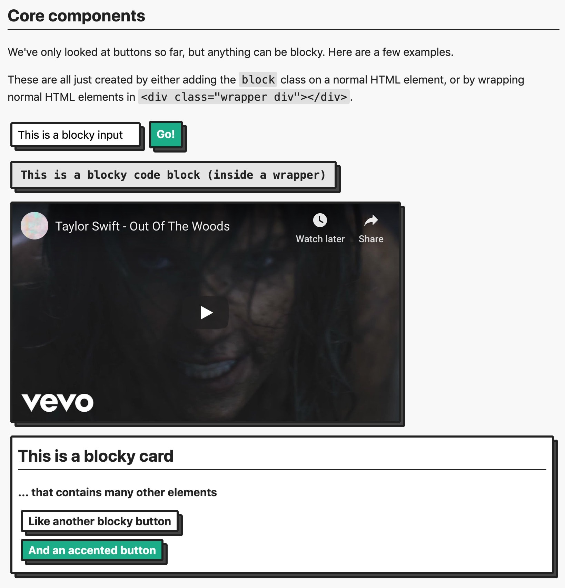

# blocks.css ☕️

Add some dimension to your page with blocks 🚀

You can check out examples and get started with **blocks.css** at the [GitHub Page 📖](https://thesephist.github.io/blocks.css/). Here's what blocks.css UI looks like, from the documentation.



Start by adding the blocks.css stylesheet to your page's `<head>`:

```html
<link rel="stylesheet" href="https://unpkg.com/blocks.css/dist/blocks.min.css" />
```

## Summary

**blocks.css** is the core of styles used in my projects like [Codeframe](https://codeframe.co), [Zero to Code](https://zerotocode.org), and [Lyrics.rip](https://genius.com/a/a-teen-programmer-built-a-tool-called-lyrics-rip-to-generate-fake-lyrics-for-your-favorite-artists). Lots of people asked for the styles, so I've pulled the button styles out into a separate package right here.

## Theming

blocks.css supports theming. By default, Blocks are turquoise-green. (Why? because it's my favorite color.) But you can use [CSS custom properties](https://developer.mozilla.org/en-US/docs/Web/CSS/--*) to modify the color and add things like a dark theme.

Check out the [documentation](https://thesephist.github.io/blocks.css/) for the full details.

## Built with blocks.css

Using **blocks.css** in your website or app? Make a pull request to add yours to the list!

- [Codeframe](https://codeframe.co): an in-browser code editor and playground
- [Read.gift](https://read.gift): an awesome service to give and receive the gift of books
- [Plume.chat](https://plume.chat): a small in-memory real time chat server with Go and WebSockets
- [Lyrics.rip](https://lyrics.rip): uses Markov chains to generate lyrics for any artist with the Genius API
- [ZeroToCode.org](https://zerotocode.org): a place for beginner coders to learn to make stuff on the web
- [1989.style](https://1989.style/): an online quiz about lines of lyrics from Taylor Swift's discography
- [Frieden](https://github.com/thesephist/frieden): a public free-busy calendar that can aggregate events from multiple Google Calendar accounts
- [Tabloid](https://tabloid.thesephist.vercel.app/): a Turing-complete programming language that reads like clickbait headlines
- [Heyyyyyyyyyyyy.com](https://heyyyyyyyyyyyy.com/): a parody of the email service Hey.com
- [Ink programming language sandbox](https://linus.zone/eval): a sandboxed playground for the [Ink programming language](https://github.com/thesephist/ink)
- [draw](https://github.com/thesephist/draw): a minimal in-memory collaborative whiteboard
- [Shelf.page](https://github.com/thesephist/shelf.page): An online, public “blog-shelf” for collecting and sharing interesting reads with your audience
- [Quarantine Resume](https://www.quarantineresu.me): A place to create a resume and showcase all the stuff you did during the 2020 coronavirus pandemic
- [Pkgreview.dev](https://pkgreview.dev): a platform for developers to rate on NPM packages
- [Own2020s.com](https://own2020s.com): Visualize the time you can save by cutting down on a habit
- [LinuxDeveloper.io](https://linuxdeveloper.io): Personal portfolio website
- [P2Pdoc](https://p2pdoc.glitch.me/): P2Pdoc allows you to create a document and then upload it to the distributed web via IPFS

[](https://repl.it/@thesephist/blockscss)
